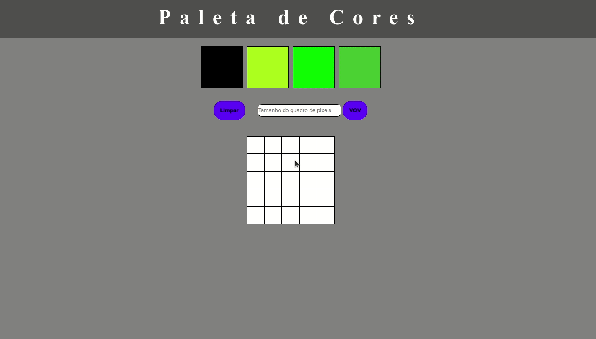

# Overview
## A Trybe study project that create and modifies elements through DOM.

  

  

## :rocket: Technologies
This project was developed with the following technologies:   

- :heavy_check_mark: HTML
- :heavy_check_mark: CSS
- :heavy_check_mark: Javascript 
  

# About this project

The idea about this project is: 
> - Generate random colors on reload. 
> - Be able to pick one color and paint pixels. 
> - Be able to define width and height with pixels (min 5 ; max 50).
> - Be able to clear all background.
---
 

## Made with :purple_heart: by Patrick =)  

## Connect with me at [LinkedIn!](https://www.linkedin.com/in/patrick-morais/)